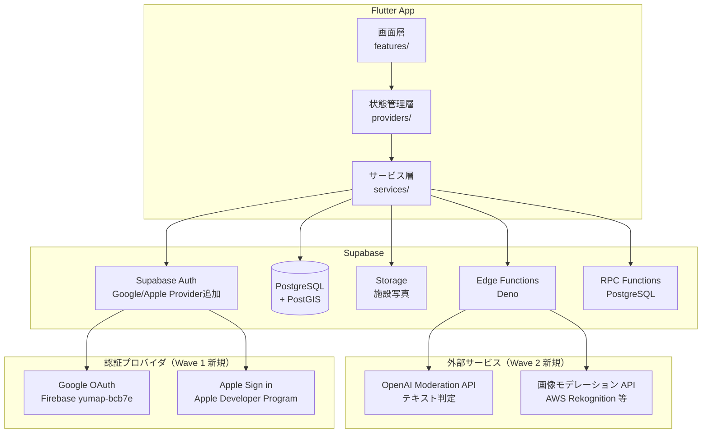

# システム設計書 — YuMap リリース前改善（Wave 1〜4）

作成日: 2026-04-29
フェーズ: Phase 3（設計）
入力: `docs/sdlc/phase-2/requirements-v2.md`

---

## Context（背景・技術スタック）

| 層 | 技術 | 備考 |
|---|---|---|
| FE | Flutter 3.x + Riverpod | lib/ 配下に全画面実装済み（セッション35まで） |
| 状態管理 | Riverpod Provider | providers/ ディレクトリに集約 |
| 地図 | flutter_map + OpenStreetMap | Google Maps 除去済み |
| BE / DB | Supabase（PostgreSQL + PostGIS） | PostGIS は initial_schema.sql で有効化済み |
| 認証 | Supabase Auth | 現在: メール/パスワードのみ |
| Storage | Supabase Storage | 写真アップロード先 |
| Edge | Supabase Edge Functions（Deno） | 既存: calculate-ranking, directions, verify-contribution |
| Firebase | Firebase Project: yumap-bcb7e | 既存。GoogleService-Info.plist / google-services.json あり |
| 外部 API | OpenAI Moderation（新規）/ 画像モデレーション API（新規） | Wave 2 で追加 |

---

## Spec（全体構成）

### コンポーネント図



### Wave 別の追加コンポーネント

| Wave | 追加コンポーネント | 担当層 |
|---|---|---|
| Wave 1a | Google Auth Provider | Supabase Auth + Flutter |
| Wave 1b | Apple Auth Provider | Supabase Auth + Flutter |
| Wave 2 | moderate-image Edge Function | Edge Functions |
| Wave 2 | moderate-text Edge Function | Edge Functions |
| Wave 2 | health-check Edge Function | Edge Functions |
| Wave 2 | validate_checkin RPC（既存 verify-contribution を拡張） | PostgreSQL RPC |
| Wave 2 | ModerationService（新規） | Flutter services/ |
| Wave 2 | ReportService（新規） | Flutter services/ |
| Wave 3 | ClusteringService 改善 | Flutter services/ |
| Wave 4 | button-test-matrix.md | docs/ |

---

## モジュール分割（責務）

### Flutter 側（新規/変更ファイル）

| ファイル | 責務 |
|---|---|
| `lib/services/moderation_service.dart`（新規） | Edge Function を呼び出してテキスト/画像を判定。health-check を先行チェック |
| `lib/services/report_service.dart`（新規） | reports テーブルへの通報レコード作成 |
| `lib/services/auth_service.dart`（新規 or 変更） | Google/Apple OAuth フロー。既存の email/password と並列管理 |
| `lib/features/auth/screens/login_screen.dart`（変更） | Google/Apple ボタン追加。規約・ポリシーリンク追加 |
| `lib/features/auth/screens/register_screen.dart`（変更） | 同上 |
| `lib/features/facility/widgets/review_card.dart`（変更） | 通報ボタン追加（kebab menu → 通報） |
| `lib/features/admin/screens/admin_reports_screen.dart`（新規） | 通報一覧・ステータス更新・削除 |
| `lib/providers/auth_provider.dart`（変更） | Google/Apple サインイン State 追加 |

### Supabase 側（新規マイグレーション）

| ファイル | 内容 |
|---|---|
| `supabase/migrations/20260429000001_add_social_auth.sql` | Wave 1: ユーザーテーブルへの provider カラム追加 |
| `supabase/migrations/20260429000002_moderation.sql` | Wave 2: reviews/photos への moderation カラム追加 |
| `supabase/migrations/20260429000003_reports.sql` | Wave 2: reports テーブル新設 |
| `supabase/migrations/20260429000004_app_admins.sql` | Wave 2: app_admins テーブル新設 |
| `supabase/migrations/20260429000005_validate_checkin_rpc.sql` | Wave 2: validate_checkin RPC（PostGIS ST_DWithin） |
| `supabase/functions/moderate-image/index.ts`（新規） | 画像モデレーション Edge Function |
| `supabase/functions/moderate-text/index.ts`（新規） | テキストモデレーション Edge Function |
| `supabase/functions/health-check/index.ts`（新規） | モデレーション API の疎通確認 |

---

## Constraints（変えてはいけないこと）

### 変更禁止コンポーネント
- `supabase/migrations/` の既存ファイルは絶対に編集しない（追記用マイグレーションのみ）
- `flutter_map` → Google Maps への差し戻し禁止
- 既存の Supabase RLS ポリシーは無効化しない（追加のみ）
- `lib/providers/` の既存 Provider のシグネチャを変えない（呼び出し側が多い）

### 可用性要件
- モデレーション API 障害時: Edge Function は 5秒タイムアウト後に `{ healthy: false }` を返す
- フォールバック: Flutter 側は health-check が unhealthy のとき投稿ボタンを disable、「5分後にお試しください」を表示
- チェックイン RPC が失敗した場合はクライアントにエラーを返す（サイレント許可はしない）

### 外部サービス依存制限
- モデレーション API キーは **Supabase Secrets のみで管理**（Flutter 側に持たせない）
- Google/Apple の OAuth Client ID は `GoogleService-Info.plist` / `google-services.json` で管理
- 新規外部 API は Edge Functions 経由のみ（Flutter から直接外部 API を叩かない）

---

## Wave 別着手タイムライン

```
Week 1  : Wave 1a — Google ログイン実装（Apple Dev Program 加入と並行）
Week 1-2: Wave 1b — Apple ログイン実装（Program 承認後）
Week 2-3: Wave 2  — モデレーション・チェックイン・通報・管理者権限
Week 3  : Wave 3  — UI改善（マーカー・シート・検索・フィード）
Week 4  : Wave 4  — ボタン網羅テスト・リリースチェックリスト最終確認
```
