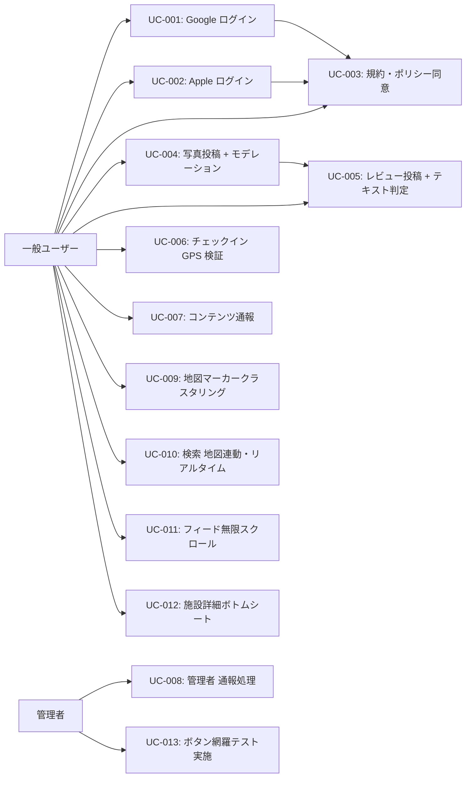

# ユースケース定義 — YuMap リリース前改善（Wave 1〜4）

作成日: 2026-04-29
フェーズ: Phase 4（ユースケース定義）
入力: `docs/sdlc/phase-3/` 設計書 3種
確認済み修正: `facility_photos` → **`photos`**（initial_schema.sql 実テーブル名）

---

## ユースケース一覧（mermaid）



---

## Wave 1: 認証強化

---

```xml
<usecase id="UC-001" name="Google アカウントでログイン / サインアップ">
  <context>
    <business>メール登録の手間を省き新規ユーザー獲得障壁を下げる。Google アカウント所有者が1タップで YuMap を使い始められる。</business>
    <related_system_state>Firebase Project yumap-bcb7e 存在確認済み。Google Auth は Firebase Console で有効化が必要（CLIENT_ID 未設定状態）。</related_system_state>
    <upstream_refs>FR-001 / POST Supabase Auth signInWithOAuth(google) / Deep Link: io.supabase.yumap://login-callback</upstream_refs>
  </context>

  <spec>
    <actor primary="未ログインユーザー" secondary="Supabase Auth / Google OAuth"/>
    <goal>Google アカウントを使って YuMap にサインイン/サインアップし、ホーム画面に到達する</goal>
    <precondition>
      - アプリが起動しておりログイン画面を表示している
      - Firebase Console で Google Auth が有効化済み
      - GoogleService-Info.plist に CLIENT_ID が設定済み
      - Info.plist に URL Scheme（io.supabase.yumap）登録済み
    </precondition>
    <main_flow>
      1. ユーザーがログイン画面で「Google でログイン」ボタンをタップ
      2. アプリが Supabase Auth signInWithOAuth(google) を呼び出す
      3. Google 認証画面（ブラウザ/WebView）が開く
      4. ユーザーが Google アカウントを選択し同意する
      5. Deep Link (io.supabase.yumap://login-callback) でアプリに戻る
      6. Supabase Auth が JWT を発行し auth_provider = 'google' で users テーブルを更新
      7. ホーム画面（地図）に遷移する
    </main_flow>
    <alt_flow>
      [A1] ユーザーがブラウザでキャンセル → ログイン画面に戻る、エラーメッセージなし
      [A2] 同一メールで既存メールアカウントが存在 → Supabase Auth がマージ or エラー → 「このメールアドレスはすでに登録済みです。メールでログインしてください」を表示
    </alt_flow>
    <exception_flow>
      [E1] ネットワーク接続なし → 「インターネット接続を確認してください」を表示
      [E2] OAuth タイムアウト（30秒） → ログイン画面に戻り「タイムアウトしました。再度お試しください」
      [E3] Deep Link が戻らない（URL Scheme 未設定） → ブラウザ画面が残る → Phase 5 実装時にテスト必須
    </exception_flow>
    <post_condition>
      - auth.users に Google プロバイダの identity が作成されている
      - users テーブルに auth_provider = 'google' のレコードが存在する
      - ホーム画面（地図タブ）が表示されている
    </post_condition>
  </spec>

  <constraints>
    <performance>認証フロー全体 P95 &lt; 3秒（NFR-007）</performance>
    <security>OAuth State パラメータを Supabase Auth が自動生成（CSRF 対策）。クライアントは OAuth Token を直接扱わない。</security>
    <accessibility>「Google でログイン」ボタンに semanticsLabel を設定する</accessibility>
  </constraints>

  <derived_tests>
    <acceptance>
      Given 未ログイン状態のログイン画面
      When 「Google でログイン」をタップし Google アカウントを選択して同意する
      Then ホーム画面（地図タブ）に遷移し、プロフィール画面に Google アカウントのアバターが表示される

      Given 既存のメールアカウントと同一メールの Google アカウントでログイン試行
      When Google 認証を完了する
      Then 「このメールアドレスはすでに登録済みです」エラーが表示され、ログイン画面に留まる
    </acceptance>
    <integration>
      - Supabase Auth の identities テーブルに google provider が記録されること
      - users テーブルの auth_provider が 'google' に更新されること
      - Deep Link のコールバックが iOS/Android 両方で動作すること
    </integration>
  </derived_tests>
</usecase>
```

---

```xml
<usecase id="UC-002" name="Apple ID でログイン / サインアップ（Wave 1b）">
  <context>
    <business>iOS App Store 審査要件（Sign in with Apple ガイドライン）。Google ログインを実装する場合は Apple ログインも必須。</business>
    <related_system_state>Apple Developer Program 未加入（Wave 1b: 加入承認後に実装）。Supabase Auth に Apple Provider を追加する。</related_system_state>
    <upstream_refs>FR-002 / POST Supabase Auth signInWithOAuth(apple) / iOS のみ</upstream_refs>
  </context>

  <spec>
    <actor primary="iOS ユーザー" secondary="Supabase Auth / Apple Sign in"/>
    <goal>Apple ID を使って YuMap にサインイン/サインアップする</goal>
    <precondition>
      - iOS デバイスで実行している（Platform.isIOS のチェック）
      - Apple Developer Program 加入・Services ID 取得済み
      - Supabase Auth の Apple Provider 設定済み
    </precondition>
    <main_flow>
      1. ユーザーが「Apple でログイン」ボタンをタップ
      2. Platform.isIOS チェック → iOS 以外は UnsupportedError（ボタン自体を非表示）
      3. Supabase Auth signInWithOAuth(apple) を呼び出す
      4. Apple 認証シート（ネイティブUI）が表示される
      5. ユーザーが Face ID / Touch ID で認証・同意する
      6. Supabase Auth が JWT を発行し users テーブルを更新
      7. ホーム画面に遷移する
    </main_flow>
    <alt_flow>
      [A1] ユーザーがメールを非公開選択 → Apple がリレーメールを提供 → Supabase Auth で受取り
      [A2] キャンセル → ログイン画面に戻る
    </alt_flow>
    <exception_flow>
      [E1] Apple Developer Program 未加入状態でテスト → Simulator では動作不可（実機必須）
      [E2] ネットワークなし → タイムアウト後にログイン画面へ
    </exception_flow>
    <post_condition>
      - auth.users に Apple プロバイダの identity が作成
      - Android では「Apple でログイン」ボタン非表示
    </post_condition>
  </spec>

  <constraints>
    <performance>P95 &lt; 3秒</performance>
    <security>Apple が発行する identity_token を Supabase Auth が検証。クライアントはトークンを保持しない。</security>
    <accessibility>iOS ネイティブ Apple Sign in ボタンのガイドライン準拠</accessibility>
  </constraints>

  <derived_tests>
    <acceptance>
      Given iOS 実機・未ログイン状態
      When 「Apple でログイン」をタップし Face ID 認証する
      Then ホーム画面に遷移し、プロフィールに Apple アカウント名が表示される

      Given Android 端末
      When ログイン画面を開く
      Then 「Apple でログイン」ボタンが表示されない
    </acceptance>
    <integration>
      - Apple の identity_token が Supabase Auth で正しく検証されること
      - メール非公開リレーアドレスでも users テーブルにレコードが作成されること
    </integration>
  </derived_tests>
</usecase>
```

---

```xml
<usecase id="UC-003" name="規約・プライバシーポリシーに同意してサインアップ">
  <context>
    <business>法的要件・App Store 審査要件。同意なしのアカウント作成を防ぐ。</business>
    <related_system_state>既存の register_screen.dart に同意 UI を追加する。</related_system_state>
    <upstream_refs>FR-004 / NFR-018</upstream_refs>
  </context>

  <spec>
    <actor primary="新規ユーザー"/>
    <goal>規約・ポリシーを確認・同意してアカウントを作成する</goal>
    <precondition>アプリが起動しており、サインアップ画面を表示している</precondition>
    <main_flow>
      1. サインアップ画面に「利用規約」「プライバシーポリシー」へのテキストリンクを表示
      2. 「同意してサインアップ」ボタン（チェックボックス連動 or ボタン前提同意）を表示
      3. ユーザーがリンクをタップ → legal_screen.dart（既存）を開く
      4. ユーザーが「同意してサインアップ」をタップ
      5. 以降は既存のサインアップフロー（または UC-001/002 の OAuth フロー）
    </main_flow>
    <alt_flow>[A1] 未同意のままボタンをタップ → ボタンが無効（disable）状態</alt_flow>
    <exception_flow>規約ページが読み込めない → キャッシュ版を表示（フォールバック）</exception_flow>
    <post_condition>同意フラグが確認された状態でアカウント作成フローが進行する</post_condition>
  </spec>

  <constraints>
    <performance>規約ページ表示 &lt; 1秒（ローカル Markdown 描画）</performance>
    <security>同意チェックはクライアント UI レベル（サーバー側での強制は今回スコープ外）</security>
    <accessibility>チェックボックスに semanticsLabel 設定</accessibility>
  </constraints>

  <derived_tests>
    <acceptance>
      Given サインアップ画面
      When 同意チェックをせずに「サインアップ」ボタンをタップ
      Then ボタンが無効のまま何も起きない

      When 「利用規約」リンクをタップ
      Then legal_screen が開く

      When チェックして「サインアップ」をタップ
      Then サインアップフローが続行する
    </acceptance>
    <integration>規約リンクが legal_screen.dart（既存）に正しく繋がること</integration>
  </derived_tests>
</usecase>
```

---

## Wave 2: 信憑性向上

---

```xml
<usecase id="UC-004" name="写真を投稿する（モデレーション自動審査付き）">
  <context>
    <business>不適切画像（NSFW/暴力）が施設ページに表示されることを防ぎ、サービスの信頼性を担保する。</business>
    <related_system_state>
      - Supabase Storage に写真アップロード済みの既存フロー
      - photos テーブル（initial_schema.sql で定義済み）
      - Edge Function moderate-image（新規追加）
    </related_system_state>
    <upstream_refs>FR-006 / POST /functions/v1/moderate-image / photos テーブル</upstream_refs>
  </context>

  <spec>
    <actor primary="ログイン済みユーザー" secondary="moderate-image Edge Function / 画像モデレーション API"/>
    <goal>施設の写真を投稿し、審査を通過した場合のみ他ユーザーに表示される</goal>
    <precondition>
      - ユーザーがログイン済み
      - health-check エンドポイントが healthy を返している
    </precondition>
    <main_flow>
      1. ユーザーが写真選択 UI から画像を選択
      2. Flutter が health-check を呼び出す（投稿前チェック）
      3. health-check が healthy → 投稿ボタンが有効
      4. ユーザーが「投稿」をタップ
      5. 画像を Supabase Storage にアップロード（storage_path 取得）
      6. moderate-image Edge Function を呼び出す（storage_path を渡す）
      7. Edge Function が画像モデレーション API（AWS Rekognition 等）を呼び出す（タイムアウト 5秒）
      8. 結果が passed → photos テーブルに moderation_status = 'passed' で INSERT
      9. 施設詳細画面に写真が表示される
    </main_flow>
    <alt_flow>
      [A1] モデレーション判定が blocked → photos に moderation_status = 'blocked' で保存（非表示）
        → ユーザーに「不適切なコンテンツが含まれる可能性があります」を表示
      [A2] health-check が unhealthy → 投稿ボタンを disable
        → 「現在写真投稿機能が停止中です。5分後にお試しください」を表示
    </alt_flow>
    <exception_flow>
      [E1] Edge Function タイムアウト（5秒超過） → moderation_status = 'blocked' として保存（安全側フォールバック）
        → ユーザーに「審査に時間がかかっています。後ほど反映されます」を表示
      [E2] Storage アップロード失敗 → 写真は保存されず、「アップロードに失敗しました」を表示
    </exception_flow>
    <post_condition>
      - passed: photos テーブルに moderation_status = 'passed'、施設詳細に表示
      - blocked: moderation_status = 'blocked'、一般ユーザーには非表示（RLS で制御）
    </post_condition>
  </spec>

  <constraints>
    <performance>Edge Function P95 &lt; 2秒（NFR-001）/ タイムアウト 5秒（NFR-003）</performance>
    <security>API キーは Supabase Secrets のみ。Flutter から外部モデレーション API を直接呼ばない。</security>
    <accessibility>ローディング中はプログレスインジケーターを表示</accessibility>
  </constraints>

  <derived_tests>
    <acceptance>
      Given ログイン済みユーザー、healthy 状態
      When 通常の施設写真を選択して投稿する
      Then 施設詳細ページに写真が表示される

      Given 不適切画像（テスト用 NSFW 画像）を投稿試行
      When 投稿ボタンをタップ
      Then 「不適切なコンテンツが含まれる可能性があります」が表示され、写真は一般ユーザーに非表示

      Given moderate-image Edge Function が停止中（health-check: unhealthy）
      When 写真投稿画面を開く
      Then 投稿ボタンが disable で「5分後にお試しください」が表示される
    </acceptance>
    <integration>
      - photos テーブルの moderation_status が正しく更新されること
      - RLS で moderation_status = 'blocked' の写真が一般クエリに含まれないこと
      - タイムアウト時に 'blocked' で保存されること（安全フォールバック確認）
    </integration>
  </derived_tests>
</usecase>
```

---

```xml
<usecase id="UC-005" name="レビューを投稿する（テキストモデレーション付き）">
  <context>
    <business>スパム・誹謗中傷・嫌がらせコンテンツの混入を防ぐ。</business>
    <related_system_state>reviews テーブル（既存）+ moderation_status カラム（新規追加）/ moderate-text Edge Function（新規）</related_system_state>
    <upstream_refs>FR-007 / FR-012（連続レビュー制限 24h）/ POST /functions/v1/moderate-text</upstream_refs>
  </context>

  <spec>
    <actor primary="ログイン済みユーザー" secondary="moderate-text Edge Function / OpenAI Moderation API"/>
    <goal>施設のレビューを投稿し、審査を通過した場合のみ表示される</goal>
    <precondition>ユーザーがログイン済み、施設詳細画面を表示している</precondition>
    <main_flow>
      1. ユーザーが「レビューを書く」ボタンをタップ
      2. canSubmitReview(facilityId) を呼び出し、24時間制限チェック
      3. 制限なし → レビュー入力フォームを表示
      4. ユーザーが評価（星）・本文を入力して「投稿」をタップ
      5. moderate-text Edge Function にレビュー本文を送信
      6. OpenAI Moderation API が判定（タイムアウト 5秒）
      7. passed → reviews テーブルに moderation_status = 'passed' で INSERT
      8. 施設詳細のレビュー一覧に追加される
    </main_flow>
    <alt_flow>
      [A1] 24時間以内に同一施設にレビュー済み → 「次のレビューまで XX 時間 XX 分」を表示してフォームを開かない
      [A2] テキスト判定が blocked → 「不適切な内容が含まれます。修正してください」を表示、再入力を促す
    </alt_flow>
    <exception_flow>
      [E1] moderate-text タイムアウト → レビューを blocked として保存（安全フォールバック）
      [E2] ネットワーク切断 → 「投稿に失敗しました。再度お試しください」
    </exception_flow>
    <post_condition>
      - passed: reviews に moderation_status = 'passed'、施設のレビュー一覧に表示
      - blocked: 非表示。ユーザーには再入力を促す
    </post_condition>
  </spec>

  <constraints>
    <performance>Edge Function P95 &lt; 1秒（NFR-002）</performance>
    <security>NGワード辞書は Edge Function に同梱（クライアント非公開）</security>
    <accessibility>エラーメッセージはフォームの直下に表示</accessibility>
  </constraints>

  <derived_tests>
    <acceptance>
      Given 同じ施設に 12時間前にレビュー済み
      When レビューを書こうとする
      Then 「次のレビューまで 12時間 0分」が表示されフォームが開かない

      Given スパム文言（「詐欺 詐欺 詐欺」等）を入力して投稿
      When 投稿ボタンをタップ
      Then 「不適切な内容が含まれます」が表示され投稿されない

      Given 正常なレビューを投稿
      Then 施設詳細のレビュー一覧に表示される
    </acceptance>
    <integration>
      - canSubmitReview が 24時間ウィンドウを正しく判定すること
      - OpenAI Moderation の結果が reviews.moderation_status に正しく反映されること
    </integration>
  </derived_tests>
</usecase>
```

---

```xml
<usecase id="UC-006" name="チェックインする（サーバー側 GPS 距離検証）">
  <context>
    <business>クライアント側の GPS 改竄バイパスを防ぎ、実際に施設を訪問したユーザーのみチェックインできる。</business>
    <related_system_state>既存の checkin_service.dart（クライアント検証）+ validate_checkin RPC（新規・PostGIS ST_DWithin）</related_system_state>
    <upstream_refs>FR-008 / validate_checkin RPC / NFR-005（P95 &lt; 500ms）/ NFR-006（距離 100m）</upstream_refs>
  </context>

  <spec>
    <actor primary="ログイン済みユーザー" secondary="validate_checkin RPC / PostGIS"/>
    <goal>施設の 100m 以内にいることをサーバー側で検証してチェックインを記録する</goal>
    <precondition>ユーザーがログイン済み、施設詳細画面を表示、GPS 許可済み</precondition>
    <main_flow>
      1. ユーザーが「チェックイン」ボタンをタップ
      2. Flutter が現在地（緯度・経度）を取得
      3. validate_checkin RPC を呼び出す（facility_id, user_lat, user_lon, max_meters=100）
      4. RPC が ST_DWithin で距離を計算
      5. 100m 以内 → { allowed: true, distance_meters: XX }
      6. visits テーブルにチェックイン記録（既存フロー）
      7. 「チェックイン完了！XX m」を表示し、バッジ判定を実行
    </main_flow>
    <alt_flow>
      [A1] 100m 超過 → { allowed: false, reason: 'too_far', distance_meters: YY }
        → 「施設から YY m 離れています。100m 以内に近づいてください」を表示
      [A2] GPS 取得失敗 → 「現在地を取得できません。GPS を確認してください」を表示
    </alt_flow>
    <exception_flow>
      [E1] RPC タイムアウト → チェックインを拒否（サイレント許可はしない）
      [E2] 施設 ID 不正 → { allowed: false, reason: 'facility_not_found' }
    </exception_flow>
    <post_condition>
      - allowed: visits テーブルに記録、ランキング更新トリガー発火
      - 拒否: visits テーブルへの記録なし
    </post_condition>
  </spec>

  <constraints>
    <performance>RPC P95 &lt; 500ms（NFR-005）</performance>
    <security>SECURITY DEFINER + authenticated ロール限定。クライアントは距離計算結果を受け取るだけ。</security>
    <accessibility>チェックイン完了ダイアログにバイブレーションフィードバック</accessibility>
  </constraints>

  <derived_tests>
    <acceptance>
      Given 施設から 50m の地点
      When チェックインボタンをタップ
      Then 「チェックイン完了！50m」が表示され visits テーブルに記録される

      Given 施設から 200m の地点（または GPS 座標を改竄したリクエスト）
      When チェックインボタンをタップ
      Then 「施設から 200m 離れています」が表示され記録されない

      Given クライアントが緯度経度を改竄（0, 0 を送信）
      When RPC が呼ばれる
      Then RPC が too_far を返し記録されない
    </acceptance>
    <integration>
      - validate_checkin RPC の ST_DWithin が 100m 境界で正確に判定すること
      - 拒否ケースで visits テーブルにレコードが作成されないこと
    </integration>
  </derived_tests>
</usecase>
```

---

```xml
<usecase id="UC-007" name="不適切なコンテンツを通報する">
  <context>
    <business>自動モデレーションが拾えなかった嫌がらせ・不適切コンテンツを事後的に排除する入口を提供する。</business>
    <related_system_state>reports テーブル（新規）/ ReportService（新規）</related_system_state>
    <upstream_refs>FR-009 / FR-010 / FR-011 / reports テーブル INSERT</upstream_refs>
  </context>

  <spec>
    <actor primary="ログイン済みユーザー" secondary="reports テーブル / 管理者（UC-008 で対応）"/>
    <goal>不適切なレビュー・写真・ユーザーを通報し、管理者に通知する</goal>
    <precondition>ユーザーがログイン済み、対象コンテンツを表示している</precondition>
    <main_flow>
      1. ユーザーがレビューカードの「…（メニュー）」をタップ
      2. 「通報する」を選択
      3. 通報理由選択ダイアログ（「スパム」「誹謗中傷」「不適切な内容」「その他」）を表示
      4. ユーザーが理由を選択して「送信」をタップ
      5. reports テーブルに INSERT（reporter_id, target_type, target_id, reason）
      6. 「通報を受け付けました」を表示してダイアログを閉じる
    </main_flow>
    <alt_flow>[A1] キャンセル → ダイアログを閉じてコンテンツ表示に戻る</alt_flow>
    <exception_flow>[E1] INSERT 失敗（ネットワーク） → 「通報の送信に失敗しました。後ほどお試しください」</exception_flow>
    <post_condition>reports テーブルに status = 'pending' のレコードが作成されている</post_condition>
  </spec>

  <constraints>
    <performance>&lt; 1秒でダイアログが表示される</performance>
    <security>reporter_id は auth.uid() で自動設定。他人の reporter_id での通報は RLS で防止。</security>
    <accessibility>通報ダイアログはモーダル。背景タップで閉じない（誤操作防止）。</accessibility>
  </constraints>

  <derived_tests>
    <acceptance>
      Given ログイン済みユーザーが不適切レビューを表示
      When 「…」→「通報する」→「誹謗中傷」→「送信」
      Then 「通報を受け付けました」が表示され reports テーブルにレコードが作成される

      Given 未ログインユーザー
      When 通報ボタンをタップ
      Then ゲスト制限ダイアログが表示される（guest_restriction_dialog.dart の既存挙動）
    </acceptance>
    <integration>reports テーブルの RLS が reporter_id = auth.uid() を強制することを確認</integration>
  </derived_tests>
</usecase>
```

---

```xml
<usecase id="UC-008" name="管理者が通報を処理する（管理者画面）">
  <context>
    <business>自動・手動の通報を管理者がトリアージし、不適切コンテンツを削除する最終手段。</business>
    <related_system_state>app_admins テーブル（新規）/ reports テーブル / admin_reports_screen.dart（新規）</related_system_state>
    <upstream_refs>FR-013 / FR-014（管理者画面最小実装）</upstream_refs>
  </context>

  <spec>
    <actor primary="管理者（app_admins メンバー）"/>
    <goal>通報一覧を確認し、対象コンテンツの削除または却下を行う</goal>
    <precondition>app_admins テーブルに管理者の user_id が登録されている</precondition>
    <main_flow>
      1. 管理者がプロフィール画面の「管理者メニュー」（app_admins 条件で表示）をタップ
      2. admin_reports_screen が開く
      3. reports テーブルから status = 'pending' の一覧を取得・表示
      4. 各通報カードに「対象を表示」「削除」「却下」ボタンを配置
      5. 「削除」をタップ → 対象コンテンツ（レビュー/写真/投稿）を論理削除
         + reports.status を 'resolved' に更新
      6. 「却下」をタップ → reports.status を 'dismissed' に更新
      7. 一覧が自動更新される
    </main_flow>
    <alt_flow>[A1] 通報が 0件 → 「現在未対応の通報はありません」を表示</alt_flow>
    <exception_flow>[E1] 削除 API 失敗 → 「削除に失敗しました」を表示してリトライを促す</exception_flow>
    <post_condition>処理済み通報の status が 'resolved' or 'dismissed' に更新されている</post_condition>
  </spec>

  <constraints>
    <performance>通報一覧の初期表示 &lt; 1秒（件数が少ないため）</performance>
    <security>app_admins に含まれないユーザーは画面にアクセスできない（RLS + UI 条件表示）</security>
    <accessibility>削除は破壊的操作のため確認ダイアログを必須とする</accessibility>
  </constraints>

  <!-- UIワイヤーフレーム（Phase 3 改善点①の解消） -->
  <!-- 
    通報一覧カードレイアウト:
    ┌─────────────────────────────────┐
    │ [target_type アイコン] [created_at]  │
    │ 通報理由: reason                     │
    │ 対象ID: target_id（短縮表示）        │
    │ [対象を表示] [削除]  [却下]          │
    └─────────────────────────────────┘
    フィルタータブ: すべて | レビュー | 写真 | ユーザー
    ソート: 新着順（デフォルト）
  -->

  <derived_tests>
    <acceptance>
      Given app_admins に登録された管理者
      When 管理者メニューを開く
      Then admin_reports_screen が表示され pending の通報一覧が表示される

      Given 通報一覧で「削除」をタップ
      When 確認ダイアログで「はい」をタップ
      Then 対象コンテンツが非表示になり、通報の status が 'resolved' になる

      Given app_admins に登録されていない一般ユーザー
      When 管理者メニューの URL/パスに直接アクセス
      Then 画面が表示されず、ホームにリダイレクト
    </acceptance>
    <integration>
      - app_admins チェックの RLS が機能すること
      - 削除後に対象コンテンツの RLS が blocked/削除状態を反映すること
    </integration>
  </derived_tests>
</usecase>
```

---

## Wave 3: UI 改善

---

```xml
<usecase id="UC-009" name="地図マーカーをクラスタリング表示する（SuperCluster）">
  <context>
    <business>1000件超の施設マーカーを同時に描画するとパフォーマンスが劣化する。クラスタリングで画面内 100件以下に抑制する。</business>
    <related_system_state>map_clustering_service.dart（既存）を SuperCluster アルゴリズムに改善。</related_system_state>
    <upstream_refs>FR-015 / NFR-008（ズーム1秒以内・30fps・画面内100件以下）</upstream_refs>
  </context>

  <!-- Phase 3 改善点②の解消: クラスタリングアルゴリズム具体化 -->
  <spec>
    <actor primary="地図利用者"/>
    <goal>スムーズにズーム・スクロールでき、マーカーが崩れない地図を閲覧する</goal>
    <precondition>地図画面が表示されている</precondition>
    <main_flow>
      1. 地図表示時に get_facilities_in_bounds RPC で施設データを取得
      2. map_clustering_service が SuperCluster アルゴリズムで施設をクラスタリング
         - ズームレベル 0〜8: 大クラスタ（件数バッジ付き円マーカー）
         - ズームレベル 9〜13: 中クラスタ（5〜20件）
         - ズームレベル 14以上: 個別マーカー（施設タイプ別色）
         - 常に画面内に描画するマーカー/クラスタ数 ≤ 100件に制限
      3. flutter_map の MarkerLayer にクラスタ結果を渡す
      4. ズーム変更時 → クラスタを再計算して再描画（目標: 1秒以内）
    </main_flow>
    <alt_flow>[A1] 0件エリア → 空地図を表示（マーカーなし）</alt_flow>
    <exception_flow>[E1] クラスタ計算が 1秒超 → 前回のクラスタ結果をキープして非同期で更新</exception_flow>
    <post_condition>画面内のマーカー/クラスタ数が 100件以下、ズーム時に崩れない</post_condition>
  </spec>

  <constraints>
    <performance>ズーム時再描画 &lt; 1秒 / スクロール中 30fps 以上（NFR-008）</performance>
    <security>特になし</security>
    <accessibility>クラスタバッジに件数の semanticsLabel を設定</accessibility>
  </constraints>

  <derived_tests>
    <acceptance>
      Given 1000件の施設データがある地図
      When ズームアウト（全国表示）
      Then クラスタが崩れず、画面内マーカー/クラスタ数が 100件以下

      When ピンチでズームイン（市区町村レベル）
      Then 1秒以内にクラスタが再描画され、個別マーカーに切り替わる

      When 地図をスクロール
      Then 30fps 以上を維持（Flutter DevTools で確認）
    </acceptance>
    <integration>SuperCluster の境界計算が flutter_map の座標系と整合すること</integration>
  </derived_tests>
</usecase>
```

---

```xml
<usecase id="UC-010" name="施設を検索する（地図連動・リアルタイム）">
  <context>
    <business>地図移動と検索を連動させ「この周辺の施設を探す」体験を実現する。</business>
    <related_system_state>search_screen.dart（既存）+ 地図移動イベントとの連動を追加。</related_system_state>
    <upstream_refs>FR-018 / FR-019（300ms リアルタイム）</upstream_refs>
  </context>

  <spec>
    <actor primary="検索ユーザー"/>
    <goal>キーワード入力・地図移動で周辺施設を素早く見つける</goal>
    <precondition>地図または検索画面を表示している</precondition>
    <main_flow>
      1. ユーザーが検索バーにキーワードを入力（debounce 300ms）
      2. 300ms 後に施設名・住所でフィルタリングクエリを実行
      3. 結果リストが即時更新される
      4. ユーザーが地図を移動（パン/ズーム）
      5. 移動完了イベントで表示エリアの bounds を取得
      6. get_facilities_in_bounds RPC でエリア内施設を再取得
      7. 検索リストと地図マーカーが同期更新される
    </main_flow>
    <alt_flow>[A1] 検索結果 0件 → 「この周辺には施設が見つかりませんでした」を表示</alt_flow>
    <exception_flow>[E1] RPC エラー → 前回の結果をキープ</exception_flow>
    <post_condition>地図の表示範囲と検索結果リストが一致している</post_condition>
  </spec>

  <constraints>
    <performance>入力から候補表示まで 300ms 以内（NFR-009）</performance>
    <security>特になし</security>
    <accessibility>検索結果リストに LiveRegion を設定（スクリーンリーダー対応）</accessibility>
  </constraints>

  <derived_tests>
    <acceptance>
      Given 検索バーに「草津」と入力
      When 300ms 経過
      Then 「草津温泉」関連の施設が即時表示される

      When 地図を別のエリアにパン
      Then 検索リストがパン先エリアの施設に更新される
    </acceptance>
    <integration>debounce 300ms のタイミングが RPC 呼び出し頻度を抑制していること</integration>
  </derived_tests>
</usecase>
```

---

## Wave 4: ボタン網羅テスト

---

```xml
<usecase id="UC-013" name="必須パスの全ボタンを網羅テストする">
  <context>
    <business>Wave 1〜3 の変更によるリグレッションを発見し、リリース前に全主要機能の動作を確認する。</business>
    <related_system_state>button-test-matrix.md（新規作成）</related_system_state>
    <upstream_refs>FR-022 / FR-023 / FR-024 / FR-025</upstream_refs>
  </context>

  <spec>
    <actor primary="開発者（手動テスト実施）"/>
    <goal>全主要ボタンの期待動作を確認し、PASS/FAIL をマトリクスに記録する</goal>
    <precondition>Wave 1〜3 の実装が完了している</precondition>
    <main_flow>
      1. button-test-matrix.md を開く
      2. 必須パス → 設定系 → 管理系の順にボタンを1つずつ操作
      3. 各ボタンについて「期待動作 / 実動作 / PASS or FAIL / 修正コミット」を記録
      4. FAIL が出た場合は修正してから再テスト
      5. 全項目 PASS でリリースチェックリストをクリア
    </main_flow>
    <alt_flow>特になし</alt_flow>
    <exception_flow>[E1] FAIL が 5件以上 → Phase 7/10（デバッグ）を先に実施してから再テスト</exception_flow>
    <post_condition>button-test-matrix.md の全項目が PASS 記録されている</post_condition>
  </spec>

  <constraints>
    <performance>テスト時間の目安: 必須パス 2時間 / 設定系 1時間 / 管理系 1時間</performance>
    <security>本番 DB を使わず、テスト用アカウントで実施する</security>
    <accessibility>スクリーンリーダーモードでも必須パスを通過すること（任意）</accessibility>
  </constraints>

  <derived_tests>
    <acceptance>
      Given Wave 1〜3 の実装完了
      When button-test-matrix の全項目を順に実施
      Then 全項目 PASS で button-test-matrix.md が完成する
    </acceptance>
    <integration>CI が存在しないため手動テストが最終確認。matrix が唯一の証跡。</integration>
  </derived_tests>
</usecase>
```

---

## ユースケース × FR トレーサビリティ表

| UC | 対応 FR | Wave |
|---|---|---|
| UC-001 | FR-001 | 1a |
| UC-002 | FR-002 | 1b |
| UC-003 | FR-004 | 1 |
| UC-004 | FR-006 | 2 |
| UC-005 | FR-007, FR-012 | 2 |
| UC-006 | FR-008 | 2 |
| UC-007 | FR-009, FR-010, FR-011 | 2 |
| UC-008 | FR-013, FR-014 | 2 |
| UC-009 | FR-015 | 3 |
| UC-010 | FR-018, FR-019 | 3 |
| UC-011 | FR-020 | 3 |
| UC-012 | FR-017 | 3 |
| UC-013 | FR-022〜025 | 4 |

---

## Phase 3 採点改善点の解消確認

| 改善点 | 解消状況 |
|---|---|
| ①管理者画面 UI ワイヤーフレーム | ✅ UC-008 の `<!-- UIワイヤーフレーム -->` コメントで定義済み |
| ②クラスタリングアルゴリズム具体化 | ✅ UC-009 で SuperCluster アルゴリズム・ズームレベル別動作を明記 |
| ③`facility_photos` テーブル名確認 | ✅ **`photos`** と確定（initial_schema.sql で確認済み）|

---

## 次フェーズ

→ **Phase 5（BE実装）**: `/sdlc-phase-5 "YuMap リリース前改善（Wave 2 信憑性向上 BE実装）"`
出力先想定: `supabase/migrations/` + `supabase/functions/`
